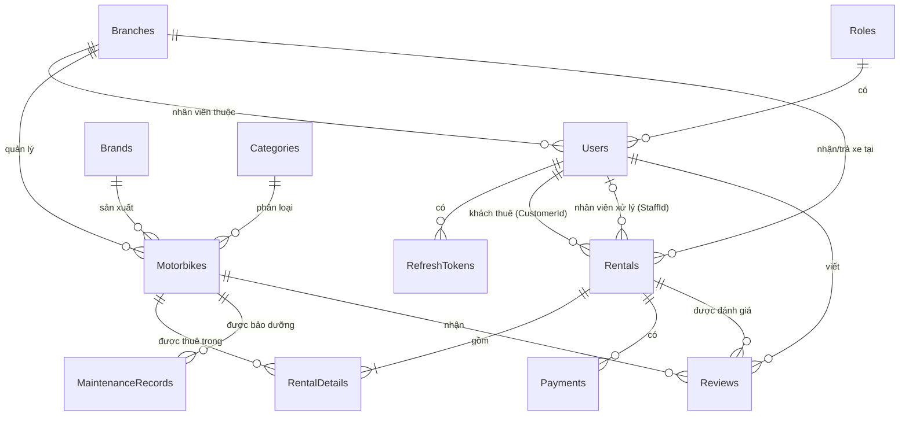

# Giải thích Database – MotorbikeRentalDB

> Đề tài: **Quản lý cửa hàng cho thuê xe máy** – PRN232
> File script: `MotorbikeRentalDB.sql` (SQL Server 2019/2022, đã chạy thử thành công)

---

## 1. Cách chạy

1. Mở **SSMS** → kết nối SQL Server → **New Query**.
2. Dán toàn bộ nội dung `MotorbikeRentalDB.sql` → **Execute (F5)**.
3. Cuối script có bảng đếm số dòng, kết quả đúng là:

| Bảng | Số dòng |
|---|---|
| Roles | 3 |
| Branches | 2 |
| Users | 8 |
| Brands | 5 |
| Categories | 4 |
| Motorbikes | 15 |
| Rentals | 8 |
| RentalDetails | 9 |
| Payments | 17 |
| MaintenanceRecords | 4 |
| Reviews | 3 |

> ⚠️ Script **xoá và tạo lại** database `MotorbikeRentalDB`. Chạy lại bất cứ lúc nào để reset dữ liệu mẫu.

### Tài khoản mẫu (mật khẩu chung: `123456`)

| Email | Vai trò | Ghi chú |
|---|---|---|
| admin@motorent.vn | Admin | Toàn quyền |
| staff1@motorent.vn | Staff | Chi nhánh Quận 1 |
| staff2@motorent.vn | Staff | Chi nhánh Thủ Đức |
| customer1@example.com → customer5@example.com | Customer | customer5 chưa có CCCD/GPLX (để test validate) |

Mật khẩu được hash bằng **BCrypt** (`$2a$11$...`). Trong API dùng NuGet `BCrypt.Net-Next`:

```csharp
bool ok = BCrypt.Net.BCrypt.Verify(dto.Password, user.PasswordHash);
string hash = BCrypt.Net.BCrypt.HashPassword(dto.Password);
```

### Kết nối từ project .NET

```json
// appsettings.json
"ConnectionStrings": {
  "DefaultConnection": "Server=localhost;Database=MotorbikeRentalDB;Trusted_Connection=True;TrustServerCertificate=True"
}
```

Scaffold (Database-First) vào project DataAccess:

```bash
dotnet ef dbcontext scaffold "Name=ConnectionStrings:DefaultConnection" Microsoft.EntityFrameworkCore.SqlServer -o Models -c MotorbikeRentalContext --no-onconfiguring --force
```

> Nếu máy dùng SQL Express thì đổi `Server=localhost` thành `Server=.\SQLEXPRESS`.

---

## 2. Sơ đồ quan hệ (ERD)



(Paste vào https://mermaid.live để xuất ảnh đưa vào báo cáo.)

---

## 3. Chi tiết từng bảng

### 3.1 `Roles` – Vai trò
| Cột | Kiểu | Ý nghĩa |
|---|---|---|
| RoleId | INT PK | 1 = Admin, 2 = Staff, 3 = Customer |
| RoleName | NVARCHAR(50) UNIQUE | Tên vai trò – **đưa vào claim `role` của JWT** |
| Description | NVARCHAR(255) | Mô tả |

### 3.2 `Branches` – Chi nhánh
Cửa hàng có nhiều chi nhánh; xe và nhân viên thuộc 1 chi nhánh.
- `OpenTime`, `CloseTime` – giờ mở cửa; ràng buộc `CloseTime > OpenTime`.
- `IsActive` – xoá mềm.

### 3.3 `Users` – Người dùng (Admin/Staff/Customer)
Dùng **một bảng** cho mọi người dùng, phân biệt bằng `RoleId` → đơn giản cho JWT + Role-based.

| Cột | Ghi chú |
|---|---|
| Email | UNIQUE, CHECK có dạng `x@y.z` – dùng làm tên đăng nhập |
| PasswordHash | BCrypt hash, **không bao giờ trả ra trong DTO** |
| Phone | 10–11 chữ số; UNIQUE nếu có (filtered index) |
| DateOfBirth | CHECK đủ 18 tuổi |
| IdentityNumber | CCCD 12 số; UNIQUE nếu có |
| DriverLicenseNumber | Số GPLX – bắt buộc khi giao xe (kiểm tra ở code) |
| BranchId | Chỉ có giá trị với Staff |
| IsActive | Admin khoá/mở tài khoản |

### 3.4 `RefreshTokens`
Lưu refresh token của JWT (tuỳ chọn – làm nếu kịp). `ON DELETE CASCADE` theo User. Token bị thu hồi khi `RevokedAt` có giá trị.

### 3.5 `Brands` – Hãng xe, `Categories` – Loại xe
Bảng danh mục đơn giản, tên UNIQUE, có `IsActive` để xoá mềm. Dữ liệu mẫu: Honda, Yamaha, Suzuki, Piaggio, VinFast / Xe số, Xe tay ga, Xe côn tay, Xe điện.

### 3.6 `Motorbikes` – Xe máy
| Cột | Ghi chú |
|---|---|
| LicensePlate | Biển số, UNIQUE |
| ModelName | Tên mẫu xe (Honda Vision…) |
| BrandId / CategoryId / BranchId | FK |
| ManufactureYear | 2000–2100 |
| EngineCapacity | 50–1500 cc, **NULL với xe điện** |
| PricePerDay | > 0 |
| DepositAmount | Tiền cọc/xe ≥ 0 |
| Odometer | Số km hiện tại ≥ 0 |
| Status | `Available` / `Rented` / `Maintenance` / `Inactive` |

**Vòng đời trạng thái xe:**
```
Available ──(giao xe)──► Rented ──(trả xe)──► Available
    │                                    │
    └──(bảo dưỡng)──► Maintenance ◄──────┘ (nếu hư hỏng)
Available ──(ngừng kinh doanh)──► Inactive
```

### 3.7 `Rentals` – Đơn thuê (header)
| Cột | Ghi chú |
|---|---|
| RentalCode | Mã đơn UNIQUE, format `RNT-yyyyMMdd-xxxx` (sinh ở code) |
| CustomerId | FK → Users (khách) |
| StaffId | FK → Users (nhân viên), NULL khi khách đặt online chưa duyệt |
| BranchId | Chi nhánh nhận/trả xe |
| StartDate / ExpectedReturnDate | CHECK `ExpectedReturnDate > StartDate` |
| ActualReturnDate | Thời gian trả thực tế; **bắt buộc khi Status = Completed** |
| SubTotal | Tổng `LineTotal` của các RentalDetails (tính ở Service) |
| DiscountAmount | ≤ SubTotal |
| LateFee / DamageFee | Phí trả trễ / hư hỏng |
| **TotalAmount** | **Cột tính toán PERSISTED** = SubTotal − Discount + LateFee + DamageFee → không cần tính ở code, **không được gán giá trị** |
| DepositAmount | Tổng tiền cọc |
| CancelReason | Lý do huỷ |

**Vòng đời đơn thuê (State machine):**
```
Pending ──(Staff duyệt)──► Confirmed ──(giao xe)──► Renting ──(trả xe)──► Completed
   │                           │
   └────────(huỷ)──────────────┴──► Cancelled
```
| Chuyển trạng thái | Ai làm | Việc phải làm trong Service |
|---|---|---|
| tạo → Pending | Customer/Staff | Kiểm tra xe `Available` & **không trùng lịch** với đơn Pending/Confirmed/Renting khác |
| Pending → Confirmed | Staff | Gán StaffId; ghi Payment Deposit |
| Confirmed → Renting | Staff | Kiểm tra CCCD + GPLX của khách; ghi PickupOdometer; xe → `Rented` |
| Renting → Completed | Staff | Ghi ActualReturnDate, ReturnOdometer, tính LateFee; xe → `Available` (hoặc `Maintenance`); cập nhật `Motorbikes.Odometer`; ghi Payment RentalFee/Penalty/Refund |
| Pending/Confirmed → Cancelled | Customer/Staff | Ghi CancelReason; hoàn cọc nếu đã đóng |

**Kiểm tra trùng lịch (quan trọng – làm ở code, không có trong DB):**
```csharp
bool isBusy = await _context.RentalDetails.AnyAsync(d =>
    d.MotorbikeId == motorbikeId &&
    (d.Rental.Status == "Pending" || d.Rental.Status == "Confirmed" || d.Rental.Status == "Renting") &&
    d.Rental.StartDate < newEnd && newStart < d.Rental.ExpectedReturnDate);
```

**Tính phí trả trễ (gợi ý quy tắc nghiệp vụ):** trễ ≤ 1 giờ miễn phí; mỗi giờ trễ tiếp theo = 10% giá/ngày; trễ > 6 giờ tính thêm 1 ngày.

### 3.8 `RentalDetails` – Chi tiết đơn (1 đơn thuê nhiều xe)
| Cột | Ghi chú |
|---|---|
| (RentalId, MotorbikeId) | UNIQUE – 1 xe không lặp trong 1 đơn |
| PricePerDay | **Snapshot giá lúc thuê** (giá xe thay đổi sau này không ảnh hưởng đơn cũ) |
| NumberOfDays | 1–90 |
| **LineTotal** | Cột tính toán = PricePerDay × NumberOfDays |
| PickupOdometer / ReturnOdometer | CHECK Return ≥ Pickup |
| PickupCondition / ReturnCondition | Biên bản tình trạng xe |

`ON DELETE CASCADE` theo Rentals.

### 3.9 `Payments` – Thanh toán
| Cột | Giá trị |
|---|---|
| PaymentType | `Deposit` (cọc), `RentalFee` (tiền thuê), `Penalty` (phạt trễ/hư hỏng), `Refund` (hoàn cọc) |
| PaymentMethod | `Cash`, `BankTransfer`, `Momo`, `VNPay` |
| Status | `Pending`, `Paid`, `Failed`, `Cancelled`; nếu `Paid` thì **bắt buộc có PaidAt** |
| Amount | > 0 |
| ProcessedBy | Staff xác nhận |

Doanh thu = tổng `RentalFee + Penalty` có Status `Paid` (Deposit/Refund chỉ là tiền giữ hộ).

### 3.10 `MaintenanceRecords` – Bảo dưỡng
Status: `Scheduled` → `InProgress` → `Completed` (hoặc `Cancelled`). Khi `InProgress` thì đặt xe `Maintenance`; khi `Completed` trả xe về `Available`. CHECK `EndDate ≥ StartDate`, `Cost ≥ 0`.

### 3.11 `Reviews` – Đánh giá
- Rating 1–5 (CHECK).
- UNIQUE (RentalId, MotorbikeId): mỗi xe trong 1 đơn chỉ được đánh giá 1 lần.
- Code phải kiểm tra: đơn thuộc về khách đang đăng nhập **và** Status = `Completed`.

---

## 4. View thống kê (Dashboard Admin)

| View | Nội dung |
|---|---|
| `vw_MonthlyRevenue` | Doanh thu theo tháng: RentalRevenue, PenaltyRevenue, TotalRevenue, RentalCount |
| `vw_MotorbikeStatistics` | Mỗi xe: số lượt thuê hoàn thành, tổng tiền mang lại, điểm đánh giá TB |

EF Core scaffold view thành entity **keyless** (`HasNoKey()`), chỉ đọc:
```csharp
var revenue = await _context.VwMonthlyRevenues.OrderBy(x => x.Year).ThenBy(x => x.Month).ToListAsync();
```

---

## 5. Ràng buộc dữ liệu – đáp ứng tiêu chí 1.5

| Loại | Ví dụ trong DB |
|---|---|
| PRIMARY KEY | Tất cả bảng (IDENTITY) |
| FOREIGN KEY | 18 khoá ngoại; CASCADE ở RentalDetails, RefreshTokens |
| UNIQUE | Email, LicensePlate, RentalCode, BrandName, CategoryName, (RentalId, MotorbikeId) |
| Filtered UNIQUE | Phone, IdentityNumber (cho phép NULL) |
| CHECK | Giá > 0, năm SX, Rating 1–5, ngày trả > ngày thuê, Status IN (...), đủ 18 tuổi, Completed thì phải có ngày trả, Paid thì phải có PaidAt |
| DEFAULT | Status, CreatedAt = SYSDATETIME(), IsActive = 1 |
| Computed column | Rentals.TotalAmount, RentalDetails.LineTotal |
| Index | Status, FK, ngày thuê (tối ưu tìm kiếm / OData `$filter`) |

**Lưu ý:** Ràng buộc DB là lớp bảo vệ cuối. Vẫn phải validate ở **DTO (DataAnnotations/FluentValidation)** để trả lỗi 400 thân thiện thay vì lỗi 500 từ SQL.

---

## 6. Ghi chú khi dùng với EF Core

1. **Status lưu dạng chuỗi** → khai báo enum trong C# và map:
   ```csharp
   public enum RentalStatus { Pending, Confirmed, Renting, Completed, Cancelled }
   // trong OnModelCreating (file partial để không bị mất khi scaffold lại):
   modelBuilder.Entity<Rental>().Property(e => e.Status).HasConversion<string>();
   ```
   Hoặc giữ `string` và dùng hằng số `RentalStatus.Pending = "Pending"` cho đơn giản.
2. **Cột computed** (`TotalAmount`, `LineTotal`): scaffold tự sinh `HasComputedColumnSql(...)` → chỉ đọc, đừng set.
3. **Không dùng trigger** → tránh lỗi EF Core 7+ với `OUTPUT` clause. Nghiệp vụ đổi trạng thái xe làm ở Service, bọc trong **transaction**:
   ```csharp
   await using var tx = await _context.Database.BeginTransactionAsync();
   // cập nhật Rental + Motorbike + thêm Payment
   await _context.SaveChangesAsync();
   await tx.CommitAsync();
   ```
4. **Không trả Entity ra API** → dùng DTO + AutoMapper (tránh vòng lặp navigation và lộ PasswordHash).
5. **OData** expose trên Entity/DTO `Motorbike`, `Rental`: ví dụ
   `GET /odata/Motorbikes?$filter=Status eq 'Available' and PricePerDay le 200000&$expand=Brand,Category&$orderby=PricePerDay&$top=10`
6. Dữ liệu ngày tháng mẫu quanh **tháng 9–10/2026**: có đơn đang thuê (5, 6), đơn chờ duyệt (7), đơn đã xác nhận (8) để demo đủ luồng.
