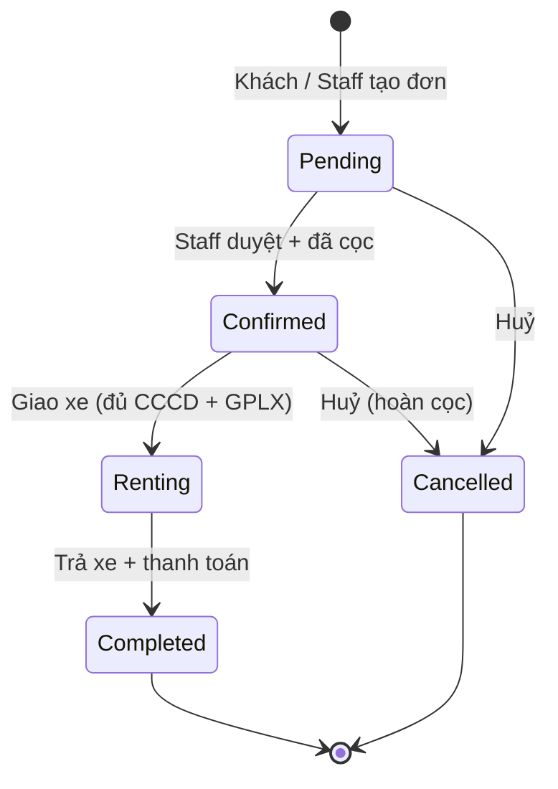
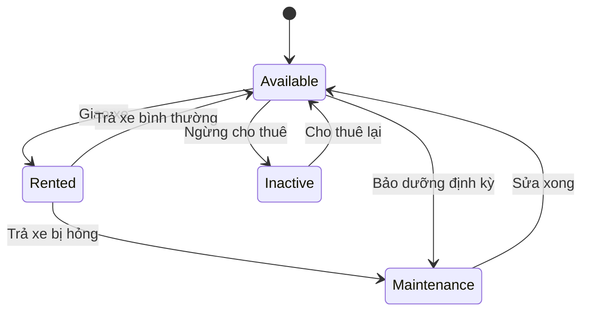

# Luồng nghiệp vụ – Cửa hàng cho thuê xe máy (MotoRent)

> Tài liệu mô tả luồng hoạt động của shop, khớp với database `MotorbikeRentalDB.sql`.
> Các sơ đồ dùng Mermaid – GitHub tự hiển thị thành hình.

---

## 1. Tác nhân và quyền

| Guest | Customer | Staff | Admin |
|---|---|---|---|
| Xem, tìm xe | + Đặt xe | + Duyệt / huỷ đơn | + Quản lý xe, hãng, loại, chi nhánh |
| Xem đánh giá | + Xem / huỷ đơn của mình | + Giao xe, nhận xe | + Quản lý tài khoản (tạo Staff, khoá/mở) |
| Đăng ký, đăng nhập | + Đánh giá xe | + Thu tiền, hoàn cọc | + Xem Dashboard doanh thu |
| | + Sửa hồ sơ (CCCD, GPLX) | + Quản lý bảo dưỡng | |

---

## 2. Luồng thuê xe tổng quát

```mermaid
sequenceDiagram
    actor C as Khách (Customer)
    actor S as Nhân viên (Staff)
    participant H as Hệ thống

    C->>H: 1. Xem / tìm xe (lọc hãng, loại, giá, chi nhánh)
    C->>H: 2. Chọn xe + ngày nhận / ngày trả
    H-->>C: Chỉ hiện xe trống, không trùng lịch
    C->>H: 3. Đặt đơn
    H-->>C: Tạo đơn RNT-yyyyMMdd-xxxx [Pending]
    C->>H: 4. Đặt cọc (chuyển khoản / Momo / VNPay)
    S->>H: 5. Duyệt đơn
    H-->>S: Đơn → [Confirmed]
    C->>S: 6. Đến cửa hàng nhận xe
    S->>H: 7. Kiểm tra CCCD + GPLX, ghi số km, tình trạng xe, giao xe
    H-->>S: Đơn → [Renting], Xe → [Rented]
    Note over C: 8. Sử dụng xe
    C->>S: 9. Mang xe đến trả
    S->>H: 10. Ghi giờ trả, số km, tình trạng; tính tiền; thu tiền + hoàn cọc
    H-->>S: Đơn → [Completed], Xe → [Available] / [Maintenance]
    C->>H: 11. Đánh giá xe (1–5 sao)
```

---

## 3. Chi tiết từng bước

### Bước 1–3: Khách đặt xe (Customer)
- Xem danh sách xe, lọc theo **hãng, loại xe, giá, chi nhánh** (API OData `/odata/Motorbikes`).
- Chọn ngày nhận – ngày trả → hệ thống chỉ hiện xe **Available** và **không trùng lịch** với đơn Pending / Confirmed / Renting khác.
- Một đơn có thể thuê **nhiều xe** (VD: 2 người đi Đà Lạt thuê 2 xe).
- Tính tiền:
  - Tiền thuê từng xe = `giá/ngày × số ngày` (giá được **lưu lại tại thời điểm thuê**)
  - Tiền cọc = tổng tiền cọc các xe
- Tạo đơn mã `RNT-yyyyMMdd-xxxx`, trạng thái **Pending**.

| Bảng liên quan | Ghi gì |
|---|---|
| `Rentals` | 1 dòng đơn thuê |
| `RentalDetails` | 1 dòng / xe |

### Bước 4–5: Đặt cọc & duyệt đơn (Staff)
- Khách đặt cọc → ghi `Payments` loại **Deposit**.
- Staff xem danh sách đơn **Pending** → **Duyệt** hoặc **Huỷ** (bắt buộc ghi lý do).
- Đơn → **Confirmed**, gán `StaffId` người duyệt.

### Bước 6–7: Giao xe (Staff)
- **Bắt buộc** khách có **CCCD + GPLX** trong hồ sơ, thiếu → không giao.
- Ghi số km lúc giao (`PickupOdometer`) và tình trạng xe (`PickupCondition`).
- Đơn → **Renting**, Xe → **Rented**.

### Bước 9–10: Trả xe (Staff)
- Ghi giờ trả thực tế (`ActualReturnDate`), số km (`ReturnOdometer`), tình trạng (`ReturnCondition`).
- Cập nhật số km của xe (`Motorbikes.Odometer`).
- Tính tiền:

| Khoản | Cách tính |
|---|---|
| Tiền thuê | Tổng `giá/ngày × số ngày` các xe |
| Phí trễ (`LateFee`) | Trễ ≤ 1 giờ: miễn phí · Mỗi giờ trễ tiếp theo: +10% giá/ngày · Trễ > 6 giờ: tính thêm 1 ngày |
| Phí hư hỏng (`DamageFee`) | Staff nhập theo thực tế |
| Giảm giá (`DiscountAmount`) | Nếu có, không vượt quá tiền thuê |
| **Tổng** | `Tiền thuê − Giảm giá + Phí trễ + Phí hư hỏng` (DB tự tính cột `TotalAmount`) |

- Ghi `Payments`: **RentalFee** (tiền thuê), **Penalty** (phạt nếu có), **Refund** (hoàn cọc).
- Đơn → **Completed**. Xe → **Available**, hoặc **Maintenance** nếu xe hỏng.
- Toàn bộ bước trả xe chạy trong **1 transaction**.

### Bước 11: Đánh giá (Customer)
- Chỉ được đánh giá khi đơn **Completed** và đơn là **của chính khách đó**.
- Mỗi xe trong 1 đơn chỉ đánh giá **1 lần**, 1–5 sao + bình luận.

---

## 4. Luồng phụ

| Luồng | Ai | Mô tả |
|---|---|---|
| **Huỷ đơn** | Customer (đơn của mình), Staff | Chỉ huỷ được khi đơn **Pending / Confirmed**. Ghi lý do, đã cọc thì hoàn cọc (Payment **Refund**). Đơn → **Cancelled** |
| **Bảo dưỡng** | Staff, Admin | Tạo lịch (**Scheduled**) → đang sửa (**InProgress**, xe → Maintenance, không cho thuê) → xong (**Completed**, xe → Available) |
| **Quản lý danh mục** | Admin | Thêm / sửa / ngừng hoạt động xe, hãng, loại xe, chi nhánh |
| **Quản lý tài khoản** | Admin | Tạo tài khoản Staff (gán chi nhánh), khoá / mở tài khoản |
| **Thống kê** | Admin | Doanh thu theo tháng (tiền thuê + phạt), số lượt thuê, xe được thuê nhiều, điểm đánh giá TB |

---

## 5. Trạng thái

### 5.1 Đơn thuê (`Rentals.Status`)



### 5.2 Xe (`Motorbikes.Status`)



### 5.3 Thanh toán (`Payments`)

| PaymentType | Khi nào | Tính vào doanh thu? |
|---|---|---|
| Deposit | Đặt cọc | ❌ (tiền giữ hộ) |
| RentalFee | Trả xe | ✅ |
| Penalty | Trả trễ / hư hỏng | ✅ |
| Refund | Hoàn cọc khi trả xe / huỷ đơn | ❌ |

---

## 6. Quy tắc nghiệp vụ (Business rules)

| # | Quy tắc | Kiểm tra ở |
|---|---|---|
| BR1 | Ngày trả phải sau ngày nhận, thuê tối đa 90 ngày | DB (CHECK) + DTO |
| BR2 | Xe không được trùng lịch với đơn Pending / Confirmed / Renting khác | Service |
| BR3 | Chỉ thuê được xe trạng thái **Available** | Service |
| BR4 | Giao xe phải có CCCD + GPLX | Service |
| BR5 | Khách phải đủ 18 tuổi | DB (CHECK) + DTO |
| BR6 | Giá thuê lưu lại tại thời điểm đặt, đổi giá xe sau không ảnh hưởng đơn cũ | `RentalDetails.PricePerDay` |
| BR7 | Chỉ chuyển trạng thái đúng theo sơ đồ 5.1 (VD: không thể trả xe khi đơn đang Pending) | Service |
| BR8 | Customer chỉ xem / huỷ / đánh giá đơn **của mình** | Service (so `CustomerId` với user trong JWT) |
| BR9 | Đánh giá chỉ khi đơn Completed, mỗi xe 1 lần / đơn | Service + DB (UNIQUE) |
| BR10 | Giảm giá không vượt quá tiền thuê | DB (CHECK) |
| BR11 | Email, biển số, CCCD, SĐT không trùng | DB (UNIQUE) |

---

## 7. Kịch bản demo (dùng dữ liệu mẫu, mật khẩu `123456`)

1. **Guest:** vào trang chủ, lọc "Xe tay ga – Honda – giá ≤ 200k".
2. **customer5@example.com:** đăng nhập → thử đặt xe → bị yêu cầu bổ sung CCCD/GPLX khi giao xe → cập nhật hồ sơ.
3. **customer1@example.com:** đặt Honda SH Mode 2 ngày → đơn Pending.
4. **staff1@motorent.vn:** duyệt đơn → giao xe → (giả lập) nhận xe trễ 3 giờ → hệ thống tính phí trễ → hoàn cọc.
5. **customer1:** đánh giá 5 sao.
6. **admin@motorent.vn:** xem Dashboard doanh thu, thêm xe mới, khoá 1 tài khoản.
7. Thử **phân quyền:** Customer gọi API duyệt đơn → bị chặn 403.
